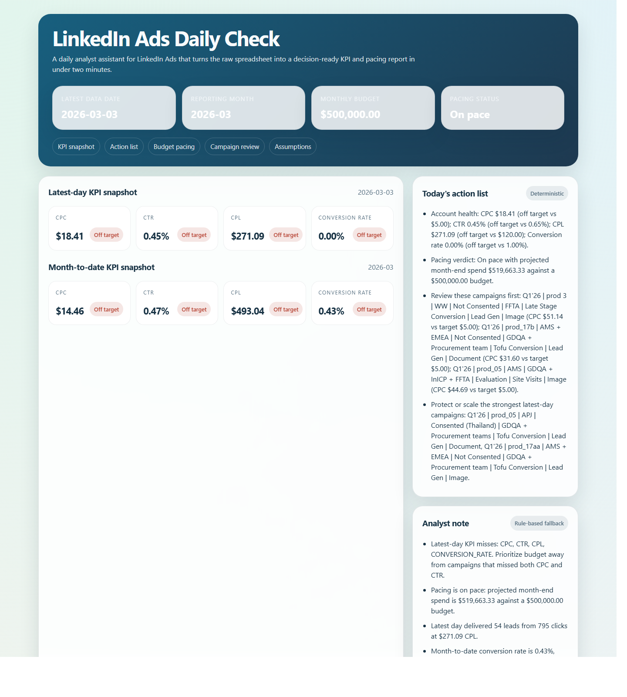
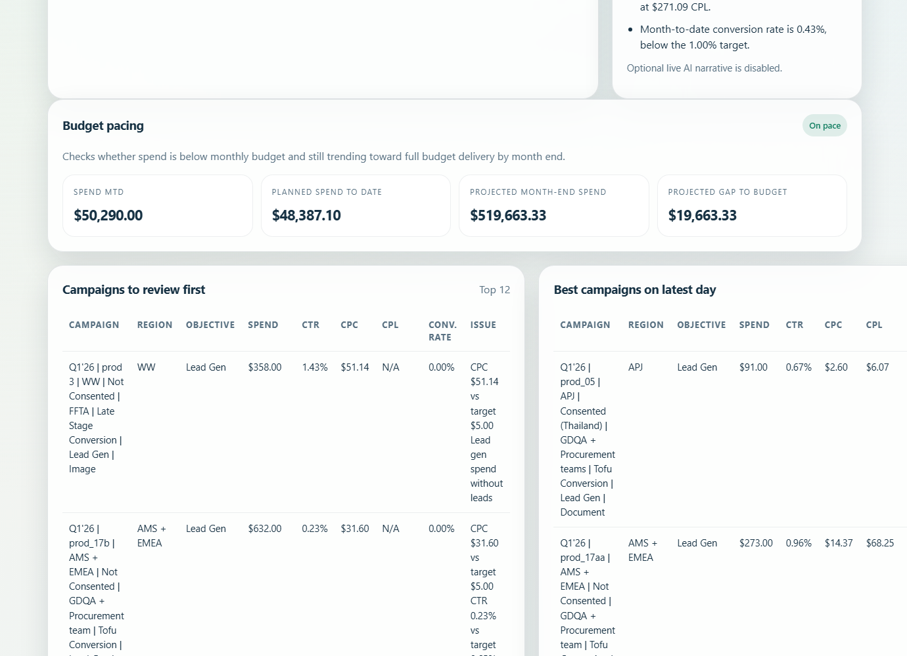

# LinkedIn Ads Daily Check

Open [output/latest_report.html](output/latest_report.html) first.

LinkedIn Ads Daily Check turns a LinkedIn campaign export into a daily account-health report for an Ads specialist. One command refreshes the report, calculates core KPIs, checks budget pacing against a configurable monthly budget, and ranks the campaigns that need manual review first.

## What This Report Answers

- Are CPC, CTR, CPL, and conversion rate on target today?
- Is month-to-date spend pacing correctly against budget?
- Which campaigns should the specialist inspect first, and why?
- What artifact can be saved or shared after each daily review?

The tool writes three artifacts on every run:

- `output/latest_report.html`: shareable HTML report
- `output/latest_report.json`: machine-readable snapshot of the scoring logic and outputs
- `output/latest_summary.md`: copy-paste summary for email, Slack, or notes

## Why This Form Factor

The workflow assumes a specialist who already works from spreadsheet exports and LinkedIn Campaign Manager. A single-file HTML report keeps that workflow simple:

- no deployment required
- one rerun command
- one visual report to review
- one JSON snapshot to archive or automate later

## What To Open First

1. Open [output/latest_report.html](output/latest_report.html).
2. Check the top KPI cards and pacing status.
3. Read the deterministic `Today's action list`.
4. Scroll to `Campaigns to review first` to see exactly why campaigns were prioritized.
5. Optionally open [output/latest_summary.md](output/latest_summary.md) for the concise daily write-up.

## 60-Second Demo Flow

1. Open [output/latest_report.html](output/latest_report.html) and frame it as the replacement for manually scanning the spreadsheet every morning.
2. Show the latest-date and month-to-date KPI snapshots.
3. Point to the pacing section to explain whether the account is under, on, or over pace.
4. Read one or two lines from `Today's action list` to show the report is action-oriented, not just a metric dump.
5. Scroll to `Campaigns to review first` and show that every prioritized row includes the reason it was flagged.
6. Close by showing that rerunning the script refreshes the HTML, JSON, and Markdown outputs.

## How To Rerun It

Default path against the public Google Sheet CSV export:

```powershell
python .\linkedin_ads_monitor.py --config .\config.example.json
```

Deterministic local test path against the shipped fixture:

```powershell
python .\linkedin_ads_monitor.py --csv-path .\fixtures\sample_linkedin_ads.csv --monthly-budget 1000
```

Automated verification:

```powershell
python -m unittest discover -s .\tests -v
```

## Prioritization Logic

Campaign ranking is rule-based and deterministic. A campaign is pushed toward the top of the review list when it breaches KPI thresholds or signals wasted spend, for example:

- CPC above target
- CTR below target
- lead-gen spend without leads
- traffic spend without conversions
- spend with no clicks

The `Best campaigns on latest day` table excludes anything already flagged for review so the report does not tell the specialist to both fix and scale the same campaign.

## AI: What It Does And What It Does Not Do

AI is optional at runtime:

- If enabled and an API key is present, it can generate the `Analyst note`.
- If no API key is present, the tool falls back to deterministic rule-based notes.
- No API key is required to review or run the included report artifacts.

AI does not calculate KPIs, pacing, or campaign ranking. Those remain deterministic in all modes so the report stays repeatable and auditable.

To enable the optional live AI note:

1. Set `OPENAI_API_KEY`
2. Change `"enabled": true` in [config.example.json](config.example.json) or pass `--enable-ai-summary`
3. Rerun the script

## Setup

Prerequisites:

- Python 3.10+
- Internet access for the live-sheet path

No third-party Python packages are required for the base version.

## Screenshots

### Report Overview



### Campaign Review



## Assumptions And Tradeoffs

- The public Google Sheet CSV export is the default live data source.
- Monthly budget is a user input because the source data does not include it.
- Campaign names are accepted in the 7-part and 8-part formats present in the source data.
- Conversion rate is calculated as `Conversions / Clicks`.
- CPL is calculated as `Total spent / Leads`; if no leads exist, CPL is shown as `N/A`.
- This v1 does not connect back to LinkedIn, edit campaigns, or automate budget changes.
